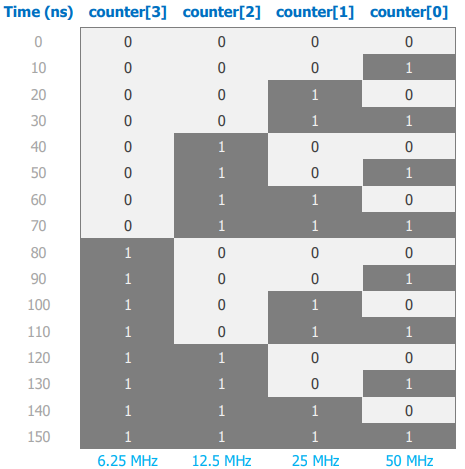
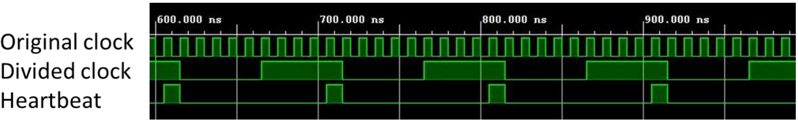

# Clock Division

The [overflow counter](./overflow-counter.md) project uses a 100 MHz clock signal. In many cases, it is necessary to generate clock signals slower than 100 Hz. A very efficient way to do this is to perform clock division using an overflow counter.

## Clock Division using an Overflow Counter

The simplest way to generate a clock divided by a factor of $2^n$ is to output the (n-1)th  bit of an overflow counter (n-1 because bus indexing starts at 0).

Consider a 4-bit counter being incremented at a rate of 100 MHz.

**Figure 1:** 4-bit overflow counter timing diagram.

The LSB is of the 4-bit counter is a periodic signal with a frequency of $\frac{100 MHz}{2^1}=50MHz$. The MSB is a preiodic signal with a frequency of $\frac{100 MHz}{2^4}=6.25 MHz$.

So, if we want to derive a 1 Hz clock from the 100 MHz master clock, we can rearrange the following equation:

$f_{div}=\frac{f_{clk}}{2^n}$

$\therefore n=log_2(\frac{f_{clk}}{f_{div}})$

Solving for $n=26.5754$. Because our overflow counter must be an integer power of 2, rounding to the nearest integer gives 27, which corresponds to a clock with a frequency of 0.7451 Hz.

In the clock division subfolder, a 27-bit overflow counter is implemented for a Basys 3 FPGA board, part number: xc7a35tcpg236-1 and used to create a 0.7451 Hz clock.

## Flexible Clock Division and Heartbeat Generator

To overcome the limitations of $2^n$ clock division, we need a more flexible method of resetting a counter when it reaches a specific value rather than relying on its periodic overflow behaviour.

Unlike the clock, which usually have a 50% duty cycle, a **heartbeat** is a signal that delivers a pulse of one clock cycle duration at regular intervals.

**Figure 2:** Example of original clock, divided clock, and a heartbeat.

With a heartbeat, we can create periodic events occuring at arbitrary subdivisions of the 100 MHz master clock.

In the clock division subfolder, a heartbeat clock divider is implemented for a Basys 3 FPGA board, part number: xc7a35tcpg236-1 and used to create a 1 Hz clock. Notably, the ``THRESHOLD`` parameter can be changed to create heartbeat signals of arbitrary frequencies.

$f_{heartbeat}=\frac{f_{clk}}{2\times THRESHOLD}$

Additionally, the clock_divider_HB_2 folder includes an additional parameter ``ON_TIME`` that allows the use to change the duty cycle of the heartbeat signal.

$D_{heartbeat}=\frac{f_{clk}}{ON\_TIME}$

> **Note:**

> Parameters can be used to declare constants. Parameters are useful to support a powerful coding technique called parameter substitution.