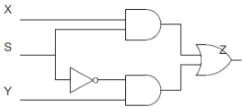
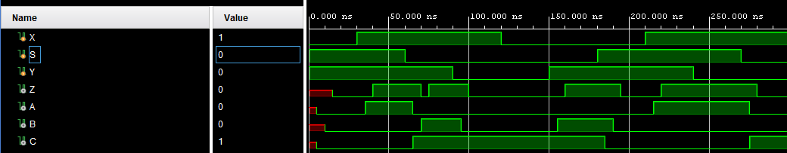
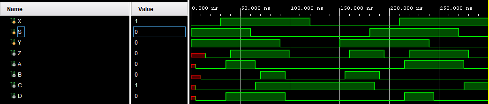

# Hazards

The [1-bit multiplexer](./mux.md) and [1-bit full adder](./full-adder.md) exercises treat circuits as ideal, i.e., with instantaneous signal changes. However, transition times in digital circuits are non-zero. When designing asynchronous digital circuits, attention must be paid to the possible presence of hazards.

> **Note:**

> All combinational circuits are asynchronous.

Consider the previously defined [1-bit multiplexer](./mux.md).

**Figure 1:** Schematic description of 1-bit MUX.

Not all signal pathways corss the same number of gates, which means they will be affected by varying amounts of delay. This can introduce timing hazards. 

The Karnaugh map (**Table 1**) can also confirm the likely presence of hazards. This circuit is implemented as a sum of products. *1-hazards can exist where any two adjacent 1s in the table are not covered by the same prime implicant loop.* This is indeed the case for our MUX.

**Table 1:** Karnaugh map for 1-bit MUX.
| S\XY | 00 | 10 | 11 | 01 |
| --- | --- | --- | --- | --- |
| **0** | 0 | 0 | 1 | 1 |
| **1** | 0 | 1 | 1 | 0 | 

In the hazards subfolder, a new project of a MUX with delays is implemented in Vivado for a Basys 3 FPGA board, part number: xc7a35tcpg236-1, to demonstrated the impact of timing hazards. 

In demonstrating the timing hazards, we define the intermediate signals:

$ C = S'$

$ A = X\cdot S$

$ B = Y \cdot C$

We add a 5ns delay to each of these signals, then define $Z$ as $A + B$ also with a 5ns delay.

**Figure 1:** Timing hazard for 1-bit MUX with delays. A timing hazard occurs in the output, Z, around timestamp 75ns.

As shown in **Figure 1**, the delays introduce a timing hazard which manifests in the output Z around timestep 75ns. This timing hazard is caused by the delay in the transition of B, which leaves a 5ns period where both A and B are 0 meaning Z is 0.

To resolve the hazard, we need to add the problematic prime implicant from the Karnaugh map to our Boolean logic expression. The new expression is given by:

$Z = (Y\cdot S') | (X\cdot S) | (X\cdot Y)$

Where the intermediate signal $D=X\cdot Y$.

**Figure 2:** The timing hazard is resolved by the new combinational logic expression.