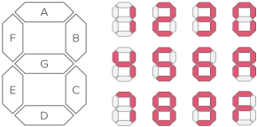
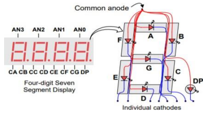
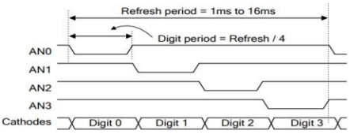

# Seven Segment Display

The Basys 3 board features a four-digit common anode seven-segment LED display. Each of the four digits is comprised of seven segments, with an LED embedded in each segment. Segment LEDs can be individually illuminated. Any of the 128 (2^7) patterns can be displayed on a digit by illuminating certain LED segments and leaving the others dark.

**Figure 1:** Seven segment display.

The anodes of the seven LED segments are tied together to form one *common anode* circuit node. The common anode signals are available as four digit enable input signals (i.e., 1000 will enable the first anode, but not the other three). The cathode circuit connections are shared amongst the four digits. There are only eight cathode signals that are drivable from the FPGA chip, called CA, CB, ..., CG and DP (decimal point), and there are connected to all four digits on the display.

**Figure 2:** Basys3 seven segment display circuit.

This means, to display multiple different digits on the display, we need to create a display driver module which enables individual digits via anode activiation and then lights up the relevant segments via cathode activation for the selected sigit. The display driver drives the anode signals and corresponding cathode patterns of each digit in a repeating rate that is faster than the human eye can detect.

**Figure 3:** Seven segment display timing diagram.

The Basys3 uses transistors to drive enough current into the common anode point meaning teh anode enables are inverted. Therefore, signals AN0 to AN3, CA to CG and DP are all driven low when active.