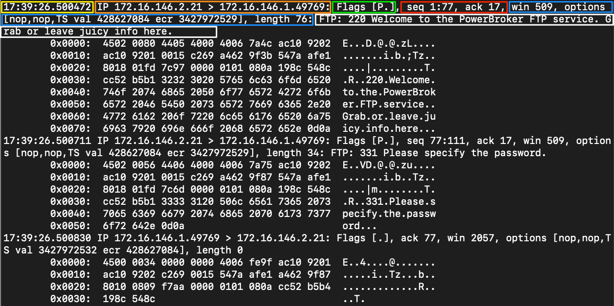

# tcpdump

`tcpdump` is a command-line packet sniffer that can capture and interpret data frames from a file or network interface. It supports [Berkeley Packet Filter](../../bpf.md) syntax.

To capture network traffic from the wire, it uses `pcap` and `libpcap` with an interface in promiscuous mode. This lets the program see packets sourced from or destined for any device on the local network, not just traffic addressed to the host.

> In networking, promiscuous mode allows a network device, such as a network interface card (NIC), to intercept and read every data packet passing through its network segment rather than just packets specifically addressed to it.

| Switch | Result |
| --- | --- |
| `-D` | Displays interfaces available for capture. |
| `-i` | Selects an interface, for example `-i eth0`. |
| `-n` | Leaves addresses as numeric values. |
| `-e` | Captures the Ethernet header as well as upper-layer data. |
| `-X` | Shows packet contents in hex and ASCII. |
| `-XX` | Shows packet contents and Ethernet headers. |
| `-v`, `-vv`, `-vvv` | Increases output verbosity. |
| `-c` | Captures a specific number of packets and then exits. |
| `-s` | Sets how much of each packet to capture. |
| `-S` | Converts relative sequence numbers to absolute sequence numbers. |
| `-q` | Prints less protocol information. |
| `-r file.pcap` | Reads from a capture file. |
| `-w file.pcap` | Writes to a capture file. |

The `-v`, `-X`, and `-e` switches increase the amount of data captured, while `-c`, `-n`, `-s`, `-S`, and `-q` reduce or reshape the output.

## Example

| Field | Meaning |
| --- | --- |
| Timestamp | `Yellow` Timestamp field, usually shown in a readable date and time format. |
| Protocol | `Orange` Upper-layer protocol, such as IP. |
| Source & Destination IP.Port | `Orange` Source and destination address plus port, for example `172.16.146.2.21`. |
| Flags | `Green` TCP flags in use. |
| Sequence and Acknowledgement Numbers | `Red` Sequence and acknowledgment numbers for the TCP segment. |
| Protocol Options | `Blue` Negotiated TCP values such as window size, selective acknowledgements, and window scaling. |
| Notes / Next Header | `White` Additional dissector notes or encapsulated protocol details. |
