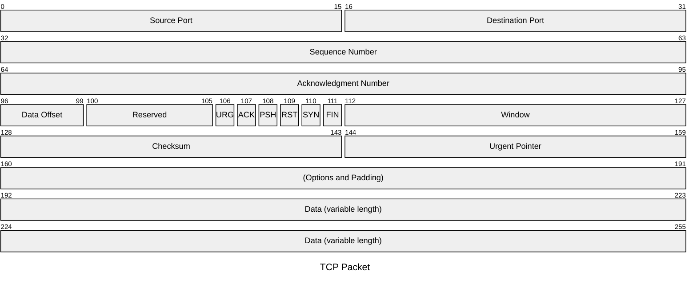
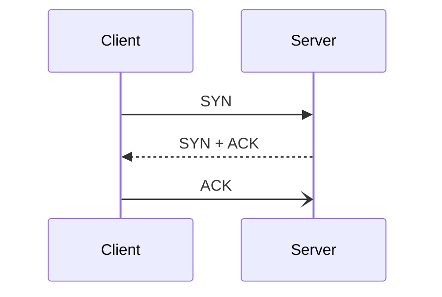
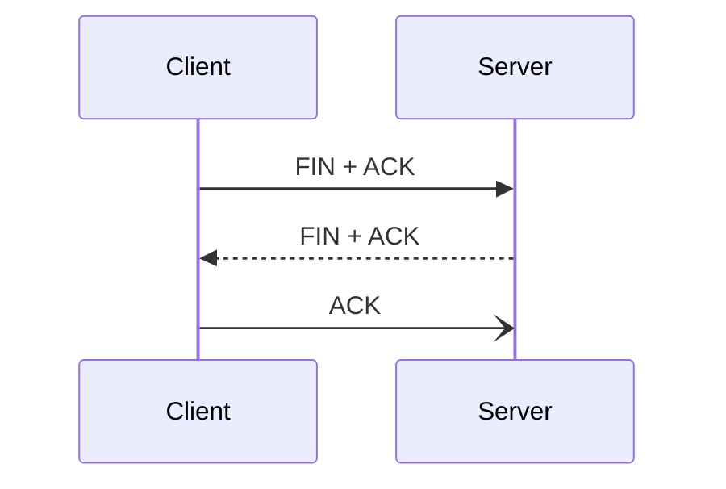

# Transport Layer

The transport layer provides end-to-end communication services for applications. It handles connection-oriented communication, reliability, flow control, congestion control, and multiplexing.

* Connection-oriented communication.
* In-order delivery.
* Reliability.
* Flow control.
* Congestion control.
* Multiplexing.

## TCP vs. UDP

The Transmission Control Protocol (TCP) ([RFC 793](https://tools.ietf.org/html/rfc793)) and User Datagram Protocol (UDP) ([RFC 768](https://tools.ietf.org/html/rfc768)) reside at the transport layer.

| Characteristic | TCP | UDP |
| --- | --- | --- |
| Transmission | Connection-oriented | Connectionless. |
| Connection establishment | Uses a three-way handshake. | Does not verify that the destination is listening. |
| Data delivery | Stream-based. | Packet-based. |
| Receipt of data | Uses sequence and acknowledgment numbers. | Does not track receipt. |
| Speed | More overhead, but reliable. | Faster, but unreliable. |

## TCP

TCP uses flags in the header. The three flags worth remembering first are SYN, ACK, and FIN.

TCP is established through a three-way handshake. First, the client sends a synchronisation packet that establishes a starting sequence number. Window size, maximum segment size, and selective acknowledgements are also negotiated here.

The server responds with a packet that includes a SYN flag for sequence number negotiation and an ACK flag to acknowledge the received SYN packet. It can also include any TCP option changes it requires in the header options field.

The client then sends a TCP packet with an ACK flag to confirm the negotiation.

## UDP

UDP is connectionless and message-oriented. It does not guarantee delivery, ordering, or retransmission, which keeps the protocol lightweight.
