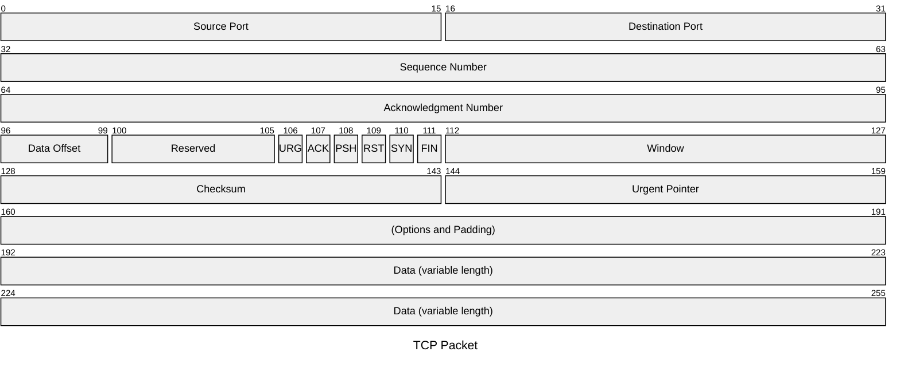
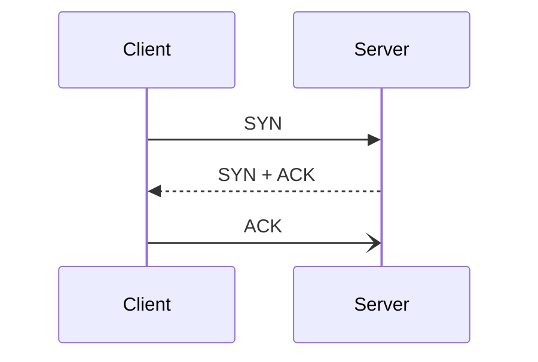
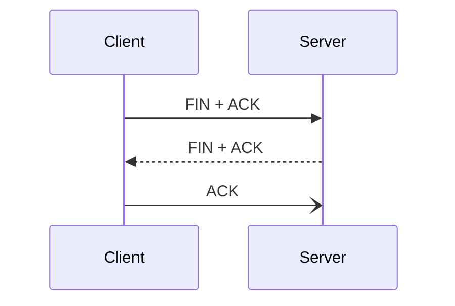

# Transport Layer

The transport layer is an abstraction layer that provides end-to-end communication services for applications. It can provide services such as connection-oriented communication, reliability, flow control, and multiplexing. The transport layer provides:

* Connection-oriented communication
* Same order delivery
* Reliability
* Flow control
* Congestion avoidance
* Multiplexing

## TCP vs. UDP

TCP and UDP reside at the transport layer.

| Characteristic | TCP | UDP |
| --- | --- | --- |
| Transmission | Connection-oriented | Connectionless. Fire and forget. |
| Connection Establishment | TCP uses a three-way handshake to ensure that a connection is established. | UDP does not ensure the destination is listening. |
| Data Delivery | Stream-based conversations | Packet by packet, the source does not care if the destination is active |
| Receipt of data | Sequence and Acknowledgement numbers are utilized to account for data. | UDP does not care. |
| Speed | TCP has more overhead and is slower because of its built-in functions. | UDP is fast but unreliable. |

## TCP

TCP utilises an option in the TCP header called flags. There are many different TCP flags; three important flags are SYN, ACK, and FIN.

TCP is established through a threeway handshake. First, the client sends a synchronisation packet that establishes a sequence number to start communication from. Window size, maximum segment size, and selective acknowledgements are also established in this packet.

The server will respond with a packet that includes a SYN flag for sequence number negotiation and an ACK flag to acknowledge the received SYN packet. The server will also include any changes to the TCP options it requires set in the options fields of the TCP header.

The client will respond with a TCP packet with an ACK flag agreeing to the negotiation.

## UDP
