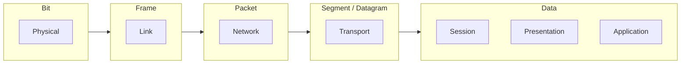

# Protocol Data Unit

A protocol data unit (PDU) is a single unit of information transmitted among peer entities of a computer network.

```mermaid
flowchart LR

subgraph Bit
    Physical
end 

subgraph Frame
    Link
end

subgraph Packet
    Network
end

subgraph Segment[Segment / Datagram]
    Transport
end

subgraph Data
    Session
    Presentation
    Application
end

Bit --> Frame --> Packet --> Segment --> Data
```
